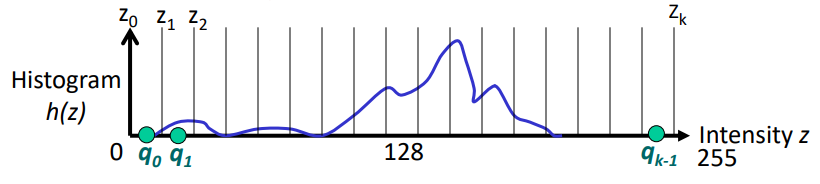
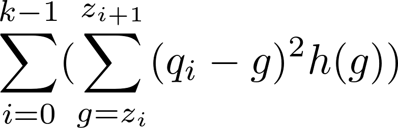
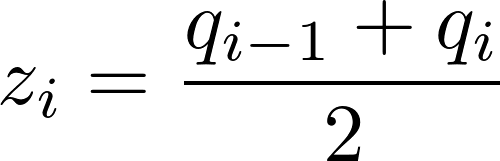
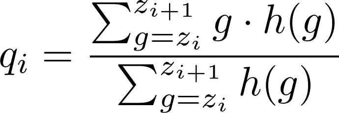
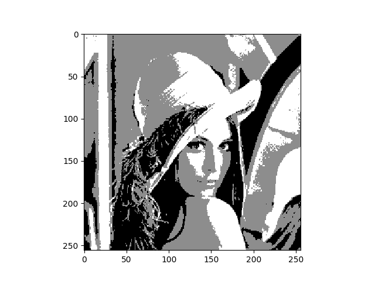
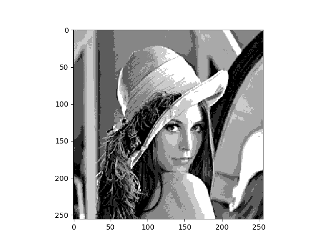

# Image Color Quantization
Python implementation of [quantization](https://en.wikipedia.org/wiki/Color_quantization).

Assume that the following is a histogram of some image:

Z values are initialized such that the number of pixels between zi+1 and zi is approximately the same (for every i). Notice that we initalize k + 1 values where k is the number of the wanted quantizations.

We will use SSD (sum of squared differences) as quantization error.
Although SSD is a poor error measure compared to human perception, it is the simplest to implement.

Therefore, our goal is to minimize the following equation:

After solving the equation we get:

# Example

Original image:

Quantization to 3 colors:

Quantization to 7 colors:

